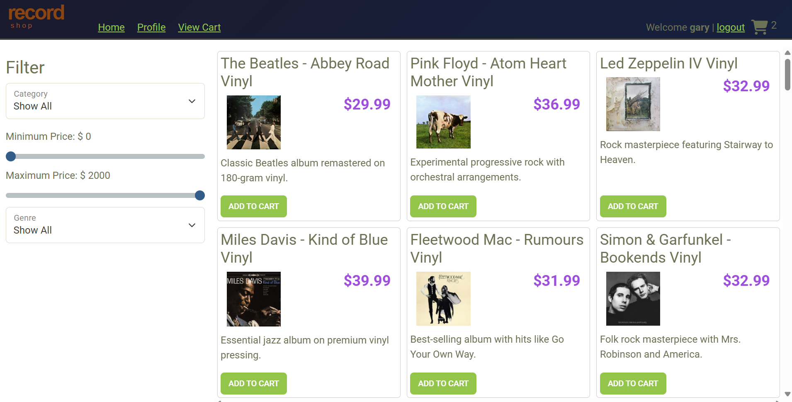

# Stereo Store Backend API

A production-ready **Spring Boot REST API** powering the Stereo Store e-commerce platform. This service manages products, categories, users, and shopping carts with secure, role-based access control and a MySQL persistence layer.

The project builds on an existing production system and introduces new features, bug fixes, and architectural improvements while maintaining backward compatibility.

---

## 🛠 Tech Stack

* **Language:** Java
* **Framework:** Spring Boot (Web, Security)
* **Database:** MySQL
* **Pattern:** JDBC / DAO (Data Access Object)
* **Build Tool:** Maven
* **Testing:** JUnit

---

## 🏗 Architecture Overview

The application follows a strict layered architecture to ensure separation of concerns:

`Controller` → `Service / DAO` → `Database`

* **Controllers:** Handle HTTP requests and response mapping.
* **DAO Layer:** Encapsulates all database access logic.
* **Models:** Represent domain entities.
* **Security Layer:** Enforces authentication and role-based authorization.

---

## ✨ Core Features

### 📂 Categories Management
* Full CRUD support for product categories.
* **Public Access:** Read-only.
* **Admin Access:** Restricted write access (Create, Update, Delete).

### 🎸 Product Management
* Advanced filtering via query parameters:
    * Category ID
    * Price range (Min/Max)
    * Sub-category
* **Search Example:** `GET /products?cat=1&minPrice=25&maxPrice=100`

### 🛒 Shopping Cart
* Scoped to the authenticated user.
* Persistent storage across sessions.
* **Actions:** Add products, update quantities, retrieve cart, and clear cart.

---

## 🔒 Security & Data

* **Spring Security:** Authentication and role-based authorization.
* **Access Control:** Modification actions (POST/PUT/DELETE) are restricted to `ADMIN` users.
* **Data Isolation:** User-specific data like shopping carts is strictly isolated per account.
* **Persistence:** Explicit SQL via the DAO pattern ensures transparency and high performance.

---

## 🔧 Bug Fixes & Improvements

* **Search Logic:** Resolved incorrect product search results by correcting filter logic.
* **Data Integrity:** Fixed product update behavior to prevent duplicate record creation.
* **Reliability:** Strengthened update and insert workflows to ensure database consistency.

---

## 🚀 API Endpoints

### Categories
| Method | Endpoint | Access |
| :--- | :--- | :--- |
| GET | `/categories` | Public |
| GET | `/categories/{id}` | Public |
| POST | `/categories` | **ADMIN** |
| PUT | `/categories/{id}` | **ADMIN** |
| DELETE | `/categories/{id}` | **ADMIN** |

### Products
| Method | Endpoint | Access |
| :--- | :--- | :--- |
| GET | `/products` | Public |
| GET | `/products/{id}` | Public |
| POST | `/products` | **ADMIN** |
| PUT | `/products/{id}` | **ADMIN** |
| DELETE | `/products/{id}` | **ADMIN** |

### Shopping Cart
| Method | Endpoint | Access |
| :--- | :--- | :--- |
| GET | `/cart` | User |
| POST | `/cart/products/{id}` | User |
| PUT | `/cart/products/{id}` | User |
| DELETE | `/cart` | User |

---

## 📂 Project Structure

```text
src/main/java/org/yearup
├── controller   # REST controllers
├── data         # Database access objects
├── model        # Domain models
├── security     # Authentication & authorization
└── App          # Application entry point
```
---

## ⚙️ Running the Application

### Prerequisites
* **Java 17+**
* **MySQL**
* **Maven**

### Steps

1. **Clone the repository:**
   ```bash
   git clone https://github.com/miaraylight/stereo-store.git
      ```

2. **Configure Database:** Update src/main/resources/application.properties with your MySQL credentials (username, password, and connection URL).

3. **Initialize Schema:** Run the provided database schema SQL script in your MySQL instance to set up the necessary tables and seed data.

4. **Start the Application:**
   ```bash
   mvn spring-boot:run
      ```
**The API will be available at:** http://localhost:8080

## 💡 Engineering Highlights
* **Legacy Code Management:** Maintained and extended a live, production-level codebase while ensuring backward compatibility.

* **Production Debugging:** Applied advanced debugging techniques to identify and resolve critical data consistency bugs.

* **Scalable Design:** Designed secure, scalable REST APIs following industry-standard backend architectural patterns.

* **State Management:** Implemented user-specific persistent states for shopping cart functionality.



**Attribution**: *Portions of this README were generated with the assistance of **Gemini**, a generative AI developed by [Google](https://ai.google/), in **December 2025**. For more information, visit [https://gemini.google.com/](https://gemini.google.com/).*